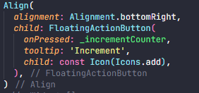
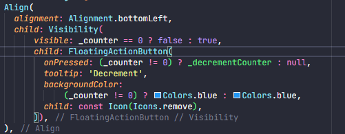
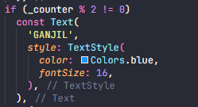
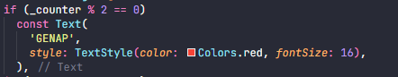
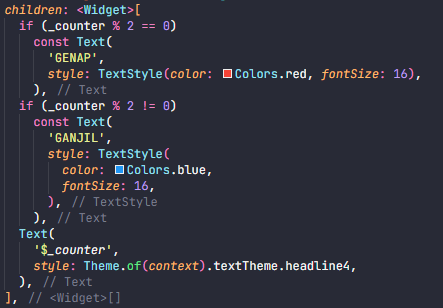
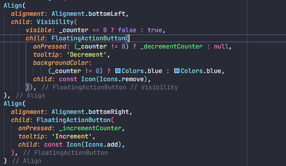

# Tugas 7

Muhammad Navis Raditya Riayatsyah (2106717291)

* Jelaskan apa yang dimaksud dengan *stateless widget* dan *stateful widget* dan jelaskan perbedaan dari keduanya.
  * *Stateless* *widget* berarti sebuah *widget* yang tidak akan bereaksi terhadap *user interaction*.
  * *Stateful widget* merupakan sebuah *widget* yang akan bereaksi terhadap *user interaction*.
* Sebutkan widget apa saja yang kamu pakai di proyek kali ini dan jelaskan fungsinya.
  * Text; Bertujuan untuk menetapkan teks yang akan muncul pada aplikasi dengan *styling format* tertentu.
  * ElevatedButton; *Widget* yang digunakan untuk memfasilitasi *user interaction.*
* Apa fungsi dari setState()? Jelaskan variabel apa saja yang dapat terdampak dengan fungsi tersebut?
  * Fungsi setState() berfungsi sebagai *method setter*. Dalam artian, fungsi tersebut akan *set* sebuah perubahan dari suatu variabel.
  * Pada program untuk Tugas 7 ini, setState() memengaruhi sebuah variabel, yaitu _counter.
* Jelaskan perbedaan antara const dengan final.
  * Const; *value* dari variabel harus diketahui pada waktu *compile*. Const akan memiliki *value* yang tetap setiap *runtime*. Const dapat diubah setelah program di-inisialisasi. (referensi: https://stackoverflow.com/questions/50431055/what-is-the-difference-between-the-const-and-final-keywords-in-dart).
  * Final; *value* dari variabel tidak harus diketahui pada waktu *compile*. Final tidak dapat diubah setelah program di-inisialisasi. (referensi: https://stackoverflow.com/questions/50431055/what-is-the-difference-between-the-const-and-final-keywords-in-dart).
* Jelaskan bagaimana caramu mengimplementasikan *checklist* di atas.
  * Tombol + menambah angka sebanyak satu satuan

    

    * Dengan menambahkan *widget* ElevatedButton sebagai *stateful widget* dan menambahkan kondisi apabila tombol ditekan maka akan dijalankan fungsi _incrementCounter().
  * Tombol - mengurangi angka sebanyak satu satuan. Apabila *counter* bernilai 0, maka tombol - tidak memiliki efek apapun pada *counter*

    

    * Dengan menambahkan *widget* ElevatedButton sebagai *stateful* *widget* dan menambahkan kondisi apabila tombol ditekan maka akan dijalankan fungsi _decrementCounter().
  * Apabila *counter* bernilai ganjil, maka teks indikator berubah menjadi "GANJIL" dengan warna biru

    

    * Dengan menambahkan kondisi dimana ketika variabel _counter tidak dapat dibagi dengan 2, maka akan menampilkan sebuah variabel *text* dengan tipe const yang memiliki parameter text('GANJIL') dan untuk memberikan warna biru.
  * Apabila *counter* bernilai genap, maka teks indikator berubah menjadi "GENAP" dengan warna merah

    

    * Dengan menambahkan kondisi dimana ketika variabel _counter dapat dibagi dengan 2, maka akan menampilkan sebuah variabel *text* dengan tipe const yang memiliki parameter text('GENAP') dan untuk memberikan warna merah.
  * Angka 0 dianggap sebagai angka genap

    

    * Dengan membuat kondisi dimana ketika _counter dapat dibagi 2, maka menjadi genap. Dan menjadikan kondisi ganjil sebagai *else condition*.
  * [BONUS] Menyembunyikan/menghilangkan tombol - apabila *counter* bernilai 0
    

    * Membuat kondisi apabila _counter bernilai 0, maka tombol *decrement* tidak ditampilkan. Berkebalikan dengan kondisi *counter* bernilai >0.
